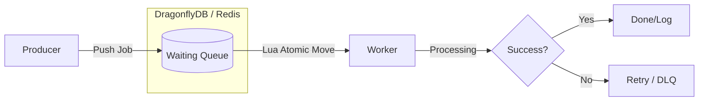

<div align="center">
  <table border="0">
    <tr>
      <td>
        
      </td>
      <td align="center">
        <h1>KODIAK 🐾</h1>
        <strong>The apex predator of job queues.</strong>
      </td>
    </tr>
  </table>
  <br />
  <div>
    <a href="https://discord.gg/vMaSpKUS4J"></a>
  </div>
  <div>
    
    
    
    
  </div>
  <div>
    
    
  </div>
  <br/>
</div>

**Kodiak** is a high-performance, distributed job queue built for the modern era of multi-threaded in-memory databases. Designed to run on **DragonflyDB** (while remaining Redis-compatible), it leverages atomic **Lua scripts** to handle massive throughput with zero race conditions.

Stop letting your background jobs hibernate. Let Kodiak maul your latency.

---

## 🌲 Why Kodiak?

Traditional Node.js queues were built when Redis was single-threaded. Today, we have **DragonflyDB**—capable of millions of ops/sec. Kodiak is architected to utilize that raw power.

- **🐾 Iron-Clad Atomicity:** Powered by custom Lua scripts. Fetching, processing, and acknowledging a job is transactionally safe. No worker ever steals another's kill.
- **⚡ Ferocious Speed:** Minimized network round-trips. Kodiak talks directly to the engine, making it ideal for high-frequency, low-latency workloads.
- **🧠 Survival Instincts:** Automatic recovery of "zombie" jobs. If a worker crashes while chewing on a task, Kodiak detects the timeout and re-queues it.
- **💎 Sharp Senses:** Written in 100% TypeScript. Enjoy full type safety from the producer to the worker.

---

## 🏗 Architecture

Kodiak uses a "Reliable Queue" pattern. It doesn't just `POP`; it atomically moves jobs between states using Lua.



---

## 🚀 Installation

```bash
npm install @legrizzly/kodiak
```

---

## 🥩 Usage

### Start DragonflyDB

```bash
docker run -p 6379:6379 --ulimit memlock=-1 docker.dragonflydb.io/dragonflydb/dragonfly
```

### Producer: Add Jobs
```typescript
import { Kodiak } from '@legrizzly/kodiak';
import type { Job } from '@legrizzly/kodiak';

interface EmailPayload {
  to: string;
  subject: string;
}

const kodiak = new Kodiak({
  connection: { host: 'localhost', port: 6379 }
});

const queue = kodiak.createQueue<EmailPayload>('emails');

await queue.add('email-1', { to: 'user@example.com', subject: 'Hi!' }, {
  priority: 1,  // 1=high, 10=normal, 100=low
  delay: 5000,  // 5 seconds
  attempts: 3,  // Retry 3 times (not auto-retrying yet)
});
```

### Consumer: Process Jobs
```typescript
const worker = kodiak.createWorker(
  'emails',
  async (jobData: EmailPayload) => {
    console.log('Processing:', jobData.to);
    await sendEmail(jobData);
  },
  { concurrency: 5 }  // Up to 5 jobs in parallel
);

worker.on('completed', (job: Job<EmailPayload>) => console.log(`✓ Done: ${job.id}`));
worker.on('failed', (job: Job<EmailPayload>, err: Error) => console.error(`✗ Failed: ${err.message}`));

await worker.start();   // Start processing
await worker.stop();    // Stop gracefully
```

---

## 🤝 Contributing

We welcome other apex predators. If you want to optimize the Lua scripts or add adapters for other DBs, pull requests are welcome.

## 📄 License

MIT © 2026
